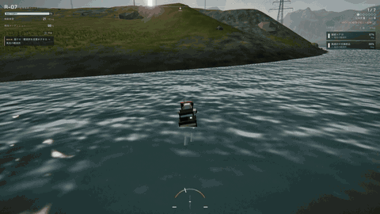
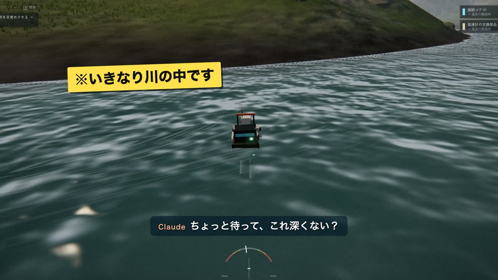
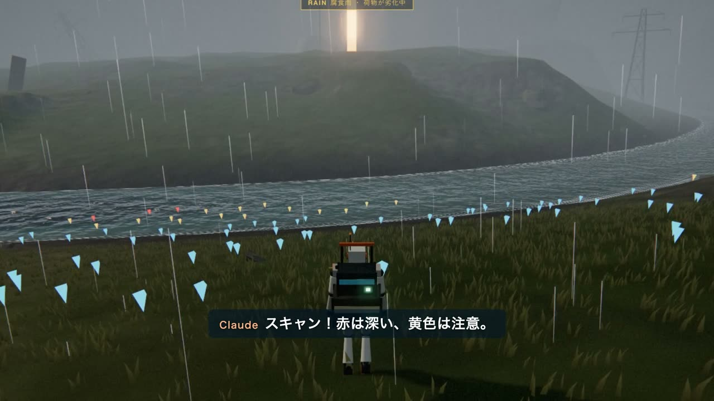
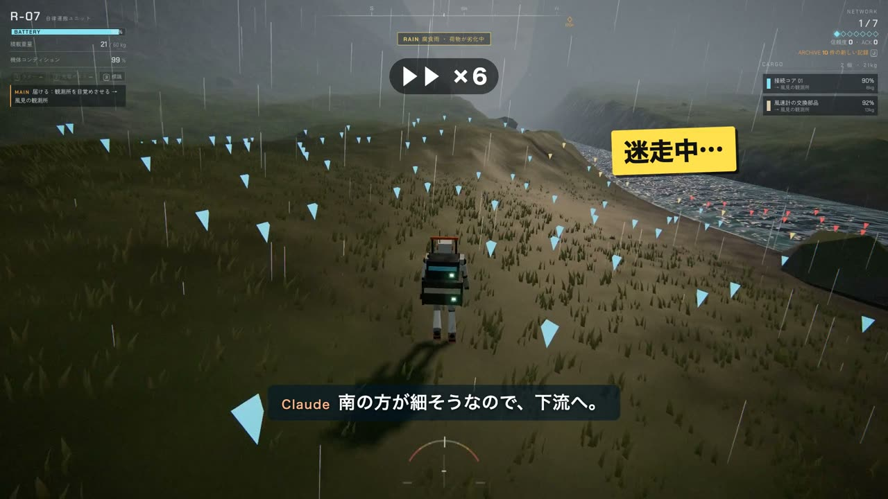
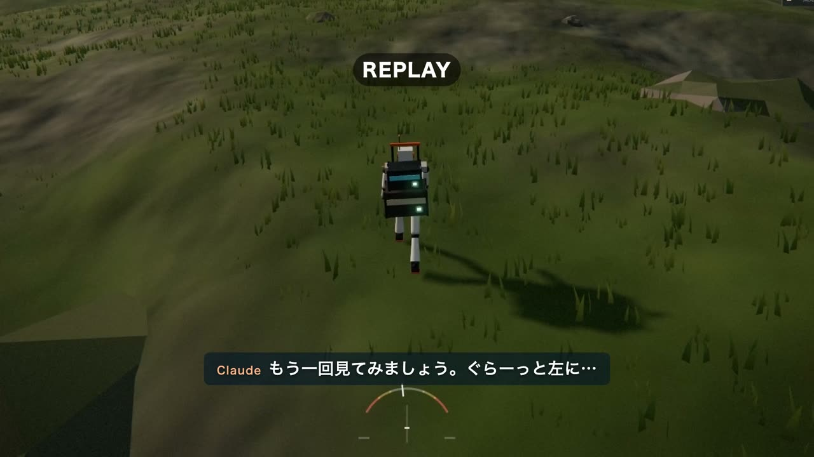

# claude-game-jikkyo（クロード・ゲーム実況）

Claude がブラウザゲームを自分で遊び、VOICEVOX の声で実況する動画を作る、Claude Code のスキル。

[](https://docs.anthropic.com/en/docs/claude-code)
[](https://www.anthropic.com/claude)
[](./LICENSE)

<p align="center">
  
</p>

**Claude Code × Claude Opus 5.5（HIGH）** で作りました。

「このゲームを遊んで、実況動画にして」と頼むと、Claude がゲームを 1 手ずつ実際に操作して遊びます。画面を見て判断し、迷ったり失敗したりしながら進め、思ったことをメモに残します。そのメモから台本を書き、VOICEVOX の声と字幕を付け、早送り・リプレイ・集中線・テロップといった YouTuber 風の編集をして MP4 に書き出します。
上の映像は、自作の配送ゲーム [LAST COURIER](https://github.com/tanuu5/last-courier) を遊んだときの実況動画（2 分 37 秒）の一部です。

## スクリーンショット

<table>
  <tr>
    <td width="50%"><br><sub>冒頭の予告。いちばんの山場を先に見せて、本編へ。</sub></td>
    <td width="50%"><br><sub>地形スキャンで川の深さを調べる。考えている間はゲームの時間が止まっている。</sub></td>
  </tr>
  <tr>
    <td><br><sub>浅瀬が見つからず、下流へ迷走。移動は早送りにして、ツッコミの札で拾う。</sub></td>
    <td><br><sub>転びかけた瞬間をスローでもう一度。</sub></td>
  </tr>
</table>

画像と動画は、すべて実際に遊んだ画面から作りました（ここでは音を外しています）。

## しくみ

- **止めながら遊ぶ**：ゲームはヘッドレスの Chrome の中で、時間を止めた状態で動きます。Claude が 1 手（どちらへ何秒歩く、押す、撮る）を送ったときだけ 1/60 秒ずつ進めて、全コマを録画します。考えている間は時間が進まないので、つないだ映像は普通に遊んでいるように見えます。
- **ゲームの音も録る**：Web Audio を同じ時計で動かし、効果音・BGM・環境音を映像のコマにそろえて書き出します（試験で誤差 2ms）。
- **別撮りで声を乗せる**：遊びながらしゃべると、セリフが映像より長くなって後ろへずれていきます。プレイ中は「このコマでこう思った」をメモに残し、あとで台本を書いて声を当てます。書き出す前に、セリフ同士が重ならないかを検査できます。
- **編集**：カット・早送り・スローのリプレイ、パンチイン（拡大）、集中線、画面の揺れ、テロップ、効果音、字幕、ゲーム音の自動の音量下げ（セリフの間）。効果音はプログラムで合成しています。

## 必要なもの

- [Claude Code](https://docs.anthropic.com/en/docs/claude-code)
- Node.js 20 以上、Google Chrome、ffmpeg（libx264）
- Python 3 と numpy・scipy・Pillow
- [VOICEVOX](https://voicevox.hiroshiba.jp/)（アプリを入れておけば、画面を開かなくても音声合成のエンジンだけを起動して使います）

動作を確かめたのは macOS（Apple Silicon）です。Windows と Linux では、Chrome と VOICEVOX を一般的なインストール先から探します。見つからないときは環境変数 `CHROME_PATH`、`VOICEVOX_ENGINE` で場所を指定してください（未確認です）。

## 入れ方

```bash
git clone https://github.com/tanuu5/claude-game-jikkyo.git ~/.claude/skills/game-jikkyo
```

Claude Code を開き直すと、スキル `game-jikkyo` が使えるようになります。

## 使い方

Claude Code で、ゲームのフォルダを示して頼みます。

> 「〇〇（フォルダ）のゲームを遊んで、実況動画にして」

Claude がスキルの手順に沿って進めます。

1. ゲームを調べる（起動のしかた、入力、読める状態、見せ場）
2. 作業フォルダにひな形を展開し、ゲームのコピーと「アダプタ」（ゲームごとの入力と状態の読み方）を用意する
3. 1 手ずつ遊び、メモを残す
4. 台本（`edit.json`）を書き、セリフの重なりを検査し、プレビューで確かめる
5. 1080p60 の MP4 に書き出す

見本のアダプタとして、[AQUA BLUE](https://github.com/tanuu5/aqua-blue)（海中探索）と [LAST COURIER](https://github.com/tanuu5/last-courier)（配送）の 2 本が入っています。手順の詳細は [SKILL.md](SKILL.md) と `references/` にあります。

## 使ってよいゲーム

- 自作のゲームや、手元で動かせるゲームが対象です。ゲームのコピーをローカルで動かし、内部の状態を読んだり入力を書き込んだりします。
- オンラインのゲームや、他人のサービス上で動くゲームには使わないでください（利用規約違反やチート行為になりえます）。
- 他人が作ったゲームの実況を公開するときは、その作品の実況・配信のガイドラインを確認してください。

## 動画を公開するとき

- VOICEVOX の声を使った動画には、`VOICEVOX:<キャラクター名>` のクレジットが必要です（台本の `credits` に書くと動画の最後に出ます。概要欄にも書いてください）。
- 声ごとに利用規約があります（既定の声は春日部つむぎ）。禁止されている内容に使わないでください。
- 確認した規約の要点を [references/licenses.md](references/licenses.md) にまとめています（確認日 2026-10-04）。これは作業の手がかりで、法的な助言ではありません。公開の前に原文を読んでください。

## 制作について

企画・ディレクション：**たぬ**　／　開発：**Claude Code（Claude Opus 5.5・推論レベル HIGH）**

最初に AQUA BLUE を遊びながら実況する形を試し、セリフのずれとゲーム音がないことが分かりました。そこで、メモを残して別に台本を書く方式と、ゲームの音を同じ時計で録る仕組みを足し、LAST COURIER の実況で通して確かめてからスキルにまとめました。ゲームの調査はサブエージェントに任せています。

## 更新履歴

- **2026-10-04**：公開

## クレジット・ライセンス

- コードと文章：MIT License（[LICENSE](LICENSE)）© 2026 たぬ
- 依存ライブラリ（同梱していません。各自で入れます）：[Puppeteer](https://github.com/puppeteer/puppeteer)（Apache-2.0）、numpy・scipy（BSD）、Pillow（MIT-CMU）。ffmpeg と Google Chrome は外部のコマンドとして呼び出します。
- 音声合成：[VOICEVOX](https://voicevox.hiroshiba.jp/)（同梱していません。利用規約は VOICEVOX と各キャラクターのものに従ってください）
- 映像の素材にしたゲーム：[LAST COURIER](https://github.com/tanuu5/last-courier)、[AQUA BLUE](https://github.com/tanuu5/aqua-blue)（どちらも MIT License、たぬ）
- MIT License の対象はこのリポジトリのコードと文章です。「Claude」の名前や商標の使用を許諾するものではありません。
